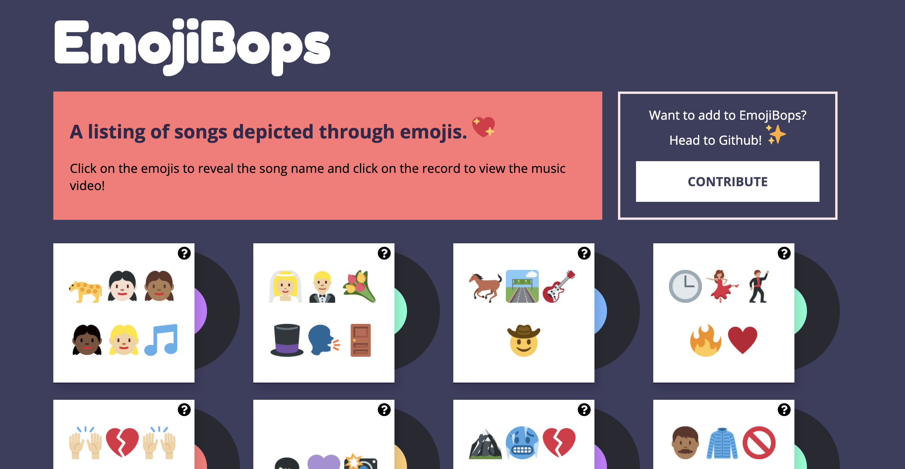
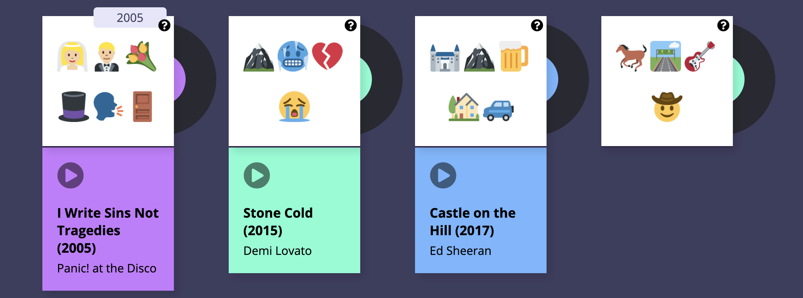
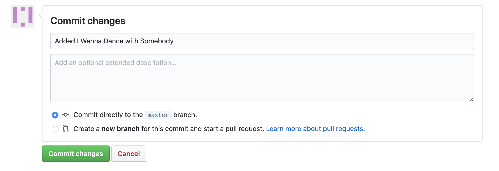
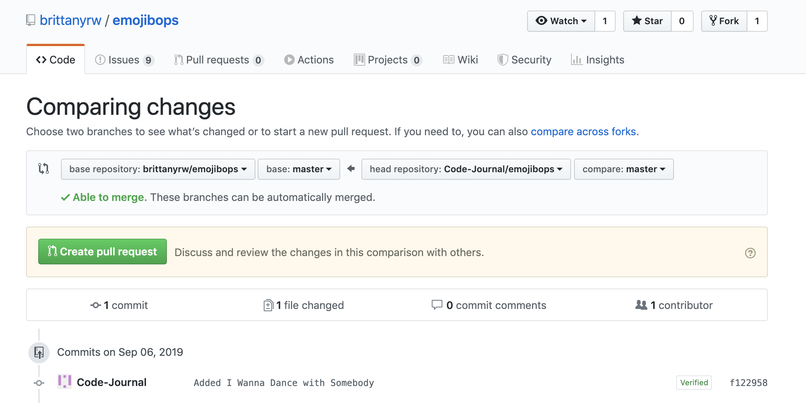

# EmojiBops 🎶 
## A listing of songs depicted through emojis.
[Visit emojibops.com](https://emojibops.com)



## Also contribute to our companion projects:

## [EmojiScreen: A listing of TV shows, movies and musicals depicted as emojis](https://github.com/brittanyrw/emojiscreen/).

## [EmojiPages: A listing of books and plays depicted via emojis](https://github.com/brittanyrw/emojipages/).

> These projects were built to create a fun, judgement free space for those learning Git and Github to practice making pull requests, branches, adding features, and more. 💛 💙 💜 💚 💖

## Contributing 🎁

Below are instructions for how to contribute to this project. The easiest way to make a contribution is to add an `Emoji Card` to the website (you can add multiple songs). Each card should be added in the `data.js` file as an object. 

For more advanced ways to contribute, see the repo Issues [under the label 'enhancement'](https://github.com/brittanyrw/emojibops/issues?q=is%3Aopen+is%3Aissue+label%3Aenhancement). 

## If you want to work on one of the Issues that are labeled with `enhancement` please comment in the Issue and wait for confirmation before you start working on it.

### 

If you want to work on one of the features but aren't sure where to start, write a comment and I will be happy to help you out or get you started. You are also welcome to suggest other features [by adding an Issue](https://github.com/brittanyrw/emojibops/issues).

Read below for a detailed overview and walkthrough on how to add an `Emoji Card` to this project. First time pull-requests are encouraged and you can make multiple pull requests if you desire. If you run into trouble, feel free [to create an Issue](https://github.com/brittanyrw/emojibops/issues)!

## Table of Contents

- [Choosing a Song to Add](#choosing-a-song)
- [Emoji Card Overview](#card-overview)
- [Contribution Walkthroughs](#walkthrough)
  - [Contribute using Github Website (no downloads required)](#github-ui)
  - [Contribute using your local development environment (downloads required)](#local-development)  
- [Git & Github Resources](#other-resources-and-options)
- [Credits](#credits)

## Choosing a Song to Add

Here are some links to lists of songs in case you're having trouble thinking of something to add! 

> Songs added must have lyrics, no instrumental songs please.

#### I have also [added Issues for individual songs](https://github.com/brittanyrw/emojibops/labels/add%20songs) that I think would be fun to add to EmojiBops. The Issues are also categoried into loose genre categories of [Pop](https://github.com/brittanyrw/emojibops/issues?q=is%3Aissue+is%3Aopen+label%3Apop), [Hip Hop](https://github.com/brittanyrw/emojibops/issues?q=is%3Aopen+is%3Aissue+label%3A%22hip+hop%22), [Rock](https://github.com/brittanyrw/emojibops/issues?q=is%3Aopen+is%3Aissue+label%3Arock), [Country](https://github.com/brittanyrw/emojibops/issues?q=is%3Aopen+is%3Aissue+label%3Acountry), [Musicals](https://github.com/brittanyrw/emojibops/issues?q=is%3Aissue+is%3Aopen+label%3Amusicals), [Disney](https://github.com/brittanyrw/emojibops/issues?q=is%3Aissue+is%3Aopen+label%3Adisney) and [R&B](https://github.com/brittanyrw/emojibops/issues?q=is%3Aopen+is%3Aissue+label%3AR%26B). 


Feel free to add any of the songs listed in Issues. Make sure to comment inside of the Issue if you plan on taking it and add the Issue number in your Pull Request.

Note: The issues to add songs have links to a Wikipedia or other page with song information, but many songs have multiple versions. Feel free to add a different version than the link if you prefer. 

### Songs
* [The Biggest Hits of All: The Hot 100's All-Time Top 100 Songs](https://www.billboard.com/articles/news/hot-100-turns-60/8468142/hot-100-all-time-biggest-hits-songs-list)
* [Billboard Hot 100 (Songs)](https://www.billboard.com/charts/hot-100)
* [GRAMMY Awards Winners for Song Of The Year/New Song Of The Year](https://www.grammy.com/grammys/awards/winners-nominees/140)
* [Top 100 Showtunes of All Time](https://www.whatsonstage.com/london-theatre/news/the-top-100-showtunes-of-all-time_45166.html)
* [Gaon Digital Chart (Korean music)](https://en.wikipedia.org/wiki/Gaon_Digital_Chart)

### Albums
* [500 Greatest Albums of All Time](https://www.rollingstone.com/music/music-lists/500-greatest-albums-of-all-time-156826/)
* [The 100 Greatest Albums of All Time](https://consequenceofsound.net/2010/09/consequence-of-sounds-top-100-albums-ever/)
* [50 Best Movie Soundtracks of All Time](https://pitchfork.com/features/lists-and-guides/the-50-best-movie-soundtracks-of-all-time/)
* [Gaon Album Chart (Korean music)](https://en.wikipedia.org/wiki/Gaon_Album_Chart)

### Artists
* [Billboard Top Artists](https://www.billboard.com/charts/year-end/top-artists)
* [Billboard Artist 100](https://www.billboard.com/charts/artist-100)
* [Bestselling Music Artists](https://en.wikipedia.org/wiki/List_of_best-selling_music_artists)
* [Top 100 Greatest Women in Music](http://www.vh1.com/news/1238/the-100-greatest-women-in-music/)

## Card Overview

On the website, each `Emoji Card` displays 1) images of the emojis, 2) a hint icon that will show the year the song was released (when the user hovers) and 3) the name of the song, the artist name and a link to the music video (which appears when the user clicks on a card).



In the `data.js` file, each `Emoji Card` consists of the following object:

```
{
  title: "Boy With Luv",
  artist: ["BTS"],
  featuredArtist: ["Halsey"],
  emojiImgs: "🧒🏻💜📸",
  musicVideo: "https://www.youtube.com/watch?v=XsX3ATc3FbA",
  genres: ["k-pop", "pop"],
  year: 2019
}
```

To add a new card to the website, add a new object in the `data.js` file. Make sure to separate your new object from existing objects with a comma. Below is an overview of each key in the `Emoji Card` object. Every key is required.

### Title 👍

Each card must have a title. This should not included featured artist names, that is added seperately so we can filter by those artist names later.

```
{
  title: "Boy With Luv",
}
```

### Emojis 😍

The emojis should be added to `emojiImgs` as a string. Your emojis should be surrounded by double quotation marks.

## **Important Note: Add six emojis maximum for each card**

```
{
  emojiImgs: "🧒🏻💜📸",
}
```

Using JavaScript, the emojis are converted into [Twemoji (Twitter's emoji version)](https://github.com/twitter/twemoji) so that all emojis will be uniform across platforms. And because they are pretty cute. 💖

Here are a few resources to find emojis to copy:

- [Twitter Emojis](https://www.piliapp.com/twitter-symbols/) - Shows you what each Twitter emoji looks like. 
- [Get Emoji](https://getemoji.com/) and [EmojiCopy](https://www.emojicopy.com/) are tools to copy regular emojis easily from one page. Note: The initial homepage does not display all skin color versions of each emoji so you will need to search in Emojipedia for those.
- [Emojipedia](https://emojipedia.org/) - A directory of all emojis.

Note when you copy these emojis and paste them into your text editor or Github, they will no longer look like the Twitter emojis. But don't worry, Javascript will convert them to the Twitter emojis on the EmojiBops website.

### Genres 🔍

The genres should be added as an array (the square [] brackets indicates an array or list). Separate each genre with a comma and each genre should be wrapped in quotes. There is no limit to the number of genres but try not to add too many.

```
{
  genres: ["k-pop", "pop"],
}
```

Select your genres from [this list of genres](https://github.com/brittanyrw/emojibops/blob/master/genres.md). If you want to use a genre that is not on this list, in your pull request please add the genre to the `genres.md` file.

If you need help selecting genres, you can sometimes find genres on the song's Wikipedia page.

### Artist 🎬

The artist(s) should be added as an array (the square [] brackets indicates an array or list). Separate each artist with a comma and each artist should be wrapped in quotes. An example with multiple artists: ```  artist: ["Lady Gaga", "Bradley Cooper"]```

For musicals, the `artist` should be the name of the show.
```
{
  artist: ["BTS"],
}
```

### Featured Artist 🎬

The featured artist(s) should be added as an array (the square [] brackets indicates an array or list). Separate each artist with a comma and each artist should be wrapped in quotes. An example with multiple featured artists: ```  featuredArtist: ["Justin Bieber", "Lil Wayne", "Quavo", "Chance the Rapper"]```

```
{
  featuredArtist: ["Halsey"],
}
```

### Music Video 

Add a link to the official music video if there is one. If there is no music video, then add a link to a performance of the song (such as on an awards show, talk show, etc). If you are not able to find a music video or performance, just try to use your best judgement when selecting a video for the song. If there are no videos, leave this item blank like so: ```musicVideo: ""```

The link must have https or http included.

```
{
  musicVideo: "https://www.youtube.com/watch?v=XsX3ATc3FbA",
}
```

### Year 📆

Specify the year the song was released. 

```
{
  year: 1994
}
```

## Walkthrough

Follow these instructions to add a card. You can add a card using the Github website user interface or on your local machine. If you do not already have one, create a Github account before proceeding.

> If you are already comfortable using Github and Git, feel free to skip the instructions below and make a pull request using whatever method you prefer!

## Github UI

### This method will use the Github website to contribute to this project. You will not need to download any programs to your computer using these instructions.
 
1. Check the Issues to see if the [song](https://github.com/brittanyrw/emojibops/labels/add%20songs) is listed. Issues by Genre: [Pop](https://github.com/brittanyrw/emojibops/issues?q=is%3Aissue+is%3Aopen+label%3Apop), [Hip Hop](https://github.com/brittanyrw/emojibops/issues?q=is%3Aopen+is%3Aissue+label%3A%22hip+hop%22), [Rock](https://github.com/brittanyrw/emojibops/issues?q=is%3Aopen+is%3Aissue+label%3Arock), [Country](https://github.com/brittanyrw/emojibops/issues?q=is%3Aopen+is%3Aissue+label%3Acountry), [Musicals](https://github.com/brittanyrw/emojibops/issues?q=is%3Aissue+is%3Aopen+label%3Amusicals), [Disney](https://github.com/brittanyrw/emojibops/issues?q=is%3Aissue+is%3Aopen+label%3Adisney) and [R&B](https://github.com/brittanyrw/emojibops/issues?q=is%3Aopen+is%3Aissue+label%3AR%26B). 
- If it is not listed as an issue, continue to the next step.
- If it is listed as an Issue, take note of the Issue number (the number next to the title of the Issue) so that you can add it to your pull request and write a comment in the Issue stating that you will be adding that particular song. If there is already a comment in the Issue from someone saying that they will add that song, choose something else to add. 
2. Fork this repository. This will create a copy of the repository and create a new repository on your account. Note: the `Fork` button is located in the top right area of the repo.
3. Once the repo is forked, you will be taken to the forked repo. Note: In the top left, the name of the repo should now include your username.
4. Navigate to the `data.js` file in your forked repo by clicking on the file name.
5. Edit the `data.js` file by clicking on the pencil icon and add a new object for your song in alphabetical order.  **Note: If the song title starts with 'The' then use the next word for alphabetical order.** Make sure there is a comma between your object and the object above and below. Refer to the card overview above for requirements for the different object keys.

Use the following object as a template:

```
{
  title: "Old Town Road",
  artist: ["Lil Nas X"],
  featuredArtist: ["Billy Ray Cyrus"],
  emojiImgs: "🐎🛣️🎸🤠",
  musicVideo: "https://www.youtube.com/watch?v=w2Ov5jzm3j8",
  genres: ["hip-hop", "country"],
  year: 2019
}
```

6. Once you have completed updating the object for your song, scroll to the bottom of the page and add a commit message. The commit message should be formatted like: `Added Wannabe by the Spice Girls` or `Added thank u next by Ariana`. Click the `Commit Changes` button to save your changes.



7. Navigate to the `Pull Request` tab. Click on New `Pull Request`.



8. Review your changes and then click `Create Pull Request`. Add any additional comments, go through the checklist within the Pull Request and add an Issue number if applicable, then click on `Create Pull Request`.
9. Wait for feedback/review of your Pull Request. Your code will be reviewed and if any changes need to be made, we will let you know. Once your pull request is accepted, you will be able to see your card at [https://emojibops.com](https://emojibops.com) and you will officially have contributed to the project! 🎉

## Local Development

### This method will use your local machine to contribute to the project. This will require you to download multiple programs onto your computer. This is the method most programmers use when working on projects. 

### Required Downloads & Tools

- Terminal (Mac OS) or Command Prompt. These are installed by default on your computer. Search for the program to open it. **For Windows, [Git Bash](https://gitforwindows.org/) is recommended.**
- [Git](https://git-scm.com/downloads) - This is a version control tool. For Windows, this download will include Git Bash.
- A text editor such as [Sublime Text](https://www.sublimetext.com/), [Atom](https://atom.io/), [Visual Studio Code](https://code.visualstudio.com/download), etc.

### Local Development Instructions

1.  Check the Issues to see if the [song](https://github.com/brittanyrw/emojibops/labels/add%20songs) is listed. Issues by Genre: [Pop](https://github.com/brittanyrw/emojibops/issues?q=is%3Aissue+is%3Aopen+label%3Apop), [Hip Hop](https://github.com/brittanyrw/emojibops/issues?q=is%3Aopen+is%3Aissue+label%3A%22hip+hop%22), [Rock](https://github.com/brittanyrw/emojibops/issues?q=is%3Aopen+is%3Aissue+label%3Arock), [Country](https://github.com/brittanyrw/emojibops/issues?q=is%3Aopen+is%3Aissue+label%3Acountry), [Musicals](https://github.com/brittanyrw/emojibops/issues?q=is%3Aissue+is%3Aopen+label%3Amusicals), [Disney](https://github.com/brittanyrw/emojibops/issues?q=is%3Aissue+is%3Aopen+label%3Adisney) and [R&B](https://github.com/brittanyrw/emojibops/issues?q=is%3Aopen+is%3Aissue+label%3AR%26B). 
- If it is not listed as an issue, continue to the next step.
- If it is listed as an Issue, take note of the Issue number (the number next to the title of the Issue) so that you can add it to your pull request and write a comment in the Issue stating that you will be adding that particular song. If there is already a comment in the Issue from someone saying that they will add that song, choose something else to add. 
2. Fork this repository. This will create a copy of the repository and create a new repository on your account.
3. Once the repo is forked, you will be taken to the forked repo.
4. Download the project to your computer. Click on the `Clone or Download` button. Copy the HTTPS github repo link.
5. In your terminal, navigate to where you would like to save the project (such as `cd Desktop`). Run the following command in the terminal, replacing the following link with your copied link: `git clone https://github.com/your-username-will-be-here/emojibops.git`;
6. After the command has been run, in the terminal, navigate into the EmojiBops project folder: `cd emojibops`.
7. Open the `emojibops` project in your text editor of choice. Edit the `data.js` file by clicking on the pencil icon and add a new object for your song in alphabetical order.  **Note: If the song title starts with 'The' then use the next word for alphabetical order.** Make sure there is a comma between your object and the object above and below. Refer to the card overview above for requirements for the different object keys. Make sure to save your file after you have made changes. 

Use the following object as a template:

```
{
  title: "Old Town Road",
  artist: ["Lil Nas X"],
  featuredArtist: ["Billy Ray Cyrus"],
  emojiImgs: "🐎🛣️🎸🤠",
  musicVideo: "https://www.youtube.com/watch?v=w2Ov5jzm3j8",
  genres: ["hip-hop", "country"],
  year: 2019
}
```

8. If you would like to see what your addition will look like, open the `index.html` file that is in the `emojibops` folder in a web browser. The EmojiCards are added in a random order so it may take you a few seconds to find what you added. If you do not see any cards in the browser, this could mean that you have a typo in your `data.js` file. If that is the case, double check what you have added for missing commas and quotation marks.
9. Once you are done, go to the terminal and type `git status`. You should see `data.js` as modified. If you don't see this, go back and make sure to save your `data.js` file.
10. Run `git add -A` to add your changes.
11. Add a commit message. Run the following command and replace with your song name: `git commit -m "Added Wannabe by Spice Girls"`.
12. If you have never used git on your computer before, you will see a message asking for you to set your email and username. If you do not see that message, continue to the next step. Run the following commands, replacing "you@example.com" with your Github email and "Your name" with your github username:

`git config --global user.email "you@example.com"`

`git config --global user.name "Your Name"`

Then re-run the commit command. Remember to replace with your song: `git commit -m "Added Wannabe by Spice Girls"`

13. Run `git push`. If you have not done this before, git push will not run until you login to your Github account. Type in your Github username and password. **NOTE: When you type your password, it will not show in the terminal. Press enter after you type your password to continue**.

14. Go to the Github website and navigate to the `Pull Request` tab. Click on New `Pull Request`.


15. Review your changes and then click `Create Pull Request`. Add any additional comments, go through the checklist within the Pull Request and add an Issue number if applicable, then click on `Create Pull Request`.
16. Wait for feedback/review of your Pull Request. Your code will be reviewed and if any changes need to be made, we will let you know. Once your pull request is accepted, you will be able to see your card at [https://emojibops.com](https://emojibops.com) and you will officially have contributed to the project! 🎉

## Other Resources and Options
* [Git Handbook](https://guides.github.com/introduction/git-handbook/)
* [Additional Git/Github Practice](https://try.github.io/)
* [Visualizing Git Commands Tool](https://git-school.github.io/visualizing-git/)
* Try creating a [new branch](https://github.com/Kunena/Kunena-Forum/wiki/Create-a-new-branch-with-git-and-manage-branches) for your pull request.
* [Syncing your Fork](https://help.github.com/en/articles/syncing-a-fork)

## Credits

💖Check out a list of all [of the EmojiBops contributors](https://github.com/brittanyrw/emojibops/graphs/contributors).

Emoji graphics are by Twitter and are licensed under CC-BY 4.0. Review the [Attribution Requirements](https://github.com/twitter/twemoji#attribution-requirements) for more information.

> Please note that this project is released with a Contributor Code of Conduct. By participating in this project you agree to abide by its terms.
